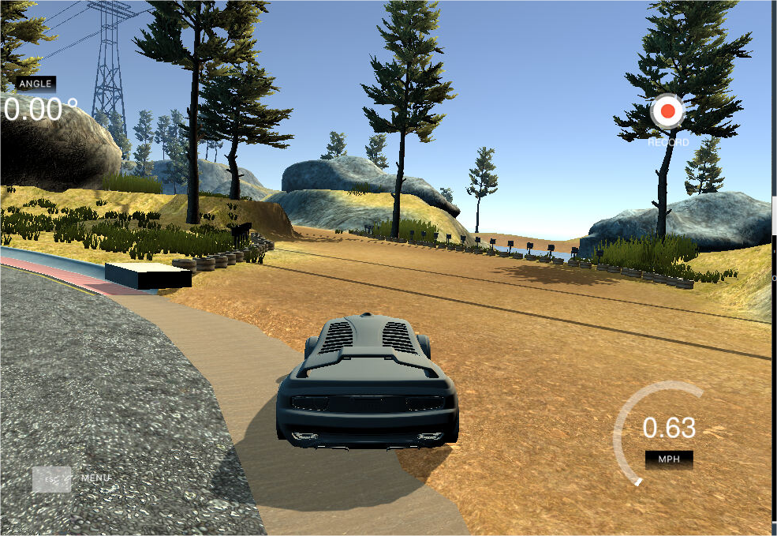

# **Behavioral Cloning** 


**Behavioral Cloning Project**

The goals / steps of this project are the following:
* Use the simulator to collect data of good driving behavior
* Build, a convolution neural network in Keras that predicts steering angles from images
* Train and validate the model with a training and validation set
* Test that the model successfully drives around track one without leaving the road
* Summarize the results with a written report


## Rubric Points
### Here I will consider the [rubric points](https://review.udacity.com/#!/rubrics/432/view) individually and describe how I addressed each point in my implementation.  

---
### Files Submitted & Code Quality

#### 1. Submission includes all required files and can be used to run the simulator in autonomous mode

My project includes the following files:
* model.py containing the script to create and train the model
* drive.py for driving the car in autonomous mode
* model.h5 containing a trained convolution neural network 
* writeup_report.md or writeup_report.pdf summarizing the results

#### 2. Submission includes functional code
Using the Udacity provided simulator and my drive.py file, the car can be driven autonomously around the track by executing 
```sh
python drive.py model.h5
```

#### 3. Submission code is usable and readable

The model.py file contains the code for training and saving the convolution neural network. The file shows the pipeline I used for training and validating the model, and it contains comments to explain how the code works.

### Model Architecture and Training Strategy

#### 1. An appropriate model architecture has been employed

My model consists of a convolution neural network that mimics NVIDIA autonomous vehicle  network.  (model.py lines 133-149) .
It was augmented with normalization layers in the beginning and then followed by 5 convolutional layers with RELU activation.
There are 4 Dense layers and I have augmented the architecture with the Dropout layers in between the Dense layers with the  keep probability of 80%. The dropout layers
were very useful in the previous project and have proven to be useful here.


#### 2. Attempts to reduce overfitting in the model

I have augmented the architecture with the Dropout layers in between the Dense layers with the  keep probability of 80%. 
I also used the callbacks attribute supported by Keras to introduce early stopping based on the increase in the validation loss.
The Patience attribute set to 2 has proven to be most useful. The early stopping did stop the training at 7 EPOCHs.

The model was trained and validated on different data sets to ensure that the model was not overfitting. The model was tested by running it through the simulator and ensuring that the vehicle could stay on the track.

#### 3. Model parameter tuning

The model used an Adam optimizer, with the learning rate of 0.0005. I used the same learning rate that worked for me the best in the previous project.
The batch size of 64 did a good job


#### 4. Appropriate training data

Training data was chosen to keep the vehicle driving on the road. I used a combination of center lane driving, recovering from the left and right sides of the road ... 

For details about how I created the training data, see the next section. 

### Model Architecture and Training Strategy

#### 1. Solution Design Approach

I tried less complicated network (LeNet) first without much success. The NVIDIA-style network seemed complex enough to handle the job.
In order to gauge how well the model was working, I split my image and steering angle data into a training and validation set. 

The final step was to run the simulator to see how well the car was driving around track one. There were a few spots where the vehicle fell off the track... to improve the driving behavior in these cases, I ....

At the end of the process, the vehicle is able to drive autonomously around the track without leaving the road.

#### 2. Final Model Architecture

My model consists of a convolution neural network that mimics NVIDIA autonomous vehicle  network.  (model.py lines 133-149) .
It was augmented with normalization layers in the beginning and then followed by 5 convolutional layers with RELU activation.
There are 4 Dense layers and I have augmented the architecture with the Dropout layers in between the Dense layers with the  keep probability of 80%. The dropout layers
were very useful in the previous project and have proven to be useful here.


#### 3. Creation of the Training Set & Training Process

While trying to capture data with the simulator I quickly discovered that, not being a gamer, my efforts only result in total waste of GPU time. I therefore used the data set provided in the /opt folder.

I used the generator  (lines 54-103) to create shuffled batches for training the network.
During the first few runs I only used the data files that were given and the model could never train to drive through the stretch of the road right after the bridge where
there is a gravel path on the right side. It was always confused into driving through the gravel and off the road.




The only thing that has helped was to introduce horizontally flipped images  into the training set. These were created on the fly by the generator (e.g. lines 71-74)

I used this training data for training the model. The validation set helped determine if the model was over or under fitting.
